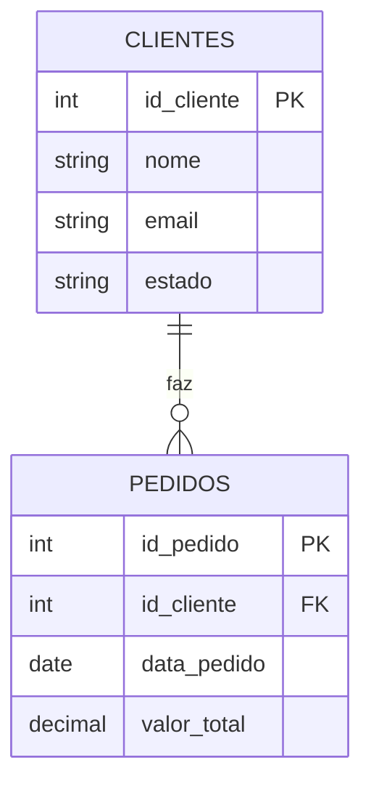

# SQL na prática: consultando dado

No capítulo anterior a gente entendeu o que é banco de dados relacional e o que é SQL, sem escrever nenhuma linha de código. Chegou a hora de sujar a mão de verdade.

Esse capítulo cobre só uma parte do SQL: **consultar** dado que já existe. Nada de somar, contar, juntar tabela ou criar/alterar nada ainda, isso fica pros próximos capítulos. Aqui o objetivo é aprender a fazer perguntas simples pro banco e receber resposta.

## Relembrando a estrutura das nossas tabelas

Vamos continuar com a mesma loja online do capítulo anterior, com a tabela de clientes e a tabela de pedidos, ligadas pela chave estrangeira `id_cliente`. Antes de mexer em código, vale fixar visualmente essa estrutura:



Repara na notação: `PK` marca a chave primária de cada tabela, `FK` marca a chave estrangeira dentro de pedidos, e a linha ligando as duas representa "um cliente faz vários pedidos". Isso é exatamente o que a gente explicou em texto no capítulo passado, só que agora dá pra enxergar.

Pra deixar os exemplos mais concretos, imagina que a tabela de clientes tem essas linhas:

| id_cliente | nome | email | estado |
|---|---|---|---|
| 1 | Ana Souza | ana@email.com | SP |
| 2 | Bruno Lima | bruno@email.com | RJ |
| 3 | Carla Dias | carla@email.com | SP |

E a tabela de pedidos tem essas linhas:

| id_pedido | id_cliente | data_pedido | valor_total |
|---|---|---|---|
| 101 | 1 | 2026-08-02 | 150.00 |
| 102 | 2 | 2026-08-10 | 89.90 |
| 103 | 1 | 2026-09-01 | 320.00 |
| 104 | 3 | 2026-09-05 | 45.00 |
| 105 | 1 | 2026-09-12 | 210.00 |

Vamos usar esses dados de exemplo em cada comando daqui pra frente.

## SELECT: pedindo dado ao banco

O primeiro problema que você tem é o mais básico possível: como eu peço pro banco me mostrar algum dado? É pra isso que existe o `SELECT`. Ele resolve exatamente essa necessidade: escolher quais colunas de uma tabela você quer ver.

A sintaxe básica é:

```sql
SELECT coluna1, coluna2
FROM tabela;
```

Se eu quiser ver só o nome e o e-mail de todo cliente:

```sql
SELECT nome, email
FROM clientes;
```

Resultado:

| nome | email |
|---|---|
| Ana Souza | ana@email.com |
| Bruno Lima | bruno@email.com |
| Carla Dias | carla@email.com |

E se eu quiser literalmente todas as colunas, sem escrever o nome de cada uma, existe um atalho: o asterisco (`*`), que significa "todas as colunas".

```sql
SELECT *
FROM clientes;
```

Isso traria a tabela de clientes inteira, com todas as quatro colunas.

## WHERE: filtrando só o que interessa

Só que só pedir coluna não resolve tudo. Na maioria das vezes você não quer a tabela inteira, você quer só algumas linhas específicas. Trazer milhão de linha quando você só precisa de dez é desperdício de processamento e de tempo. É esse problema que o `WHERE` resolve: ele filtra, trazendo só as linhas que atendem a uma condição.

Sintaxe:

```sql
SELECT coluna1, coluna2
FROM tabela
WHERE condicao;
```

Por exemplo, se eu quiser só os clientes do estado de São Paulo:

```sql
SELECT nome, email
FROM clientes
WHERE estado = 'SP';
```

Resultado:

| nome | email |
|---|---|
| Ana Souza | ana@email.com |
| Carla Dias | carla@email.com |

Dá pra usar outros tipos de comparação além de igualdade, tipo "maior que". Se eu quiser só os pedidos com valor acima de cem reais:

```sql
SELECT id_pedido, valor_total
FROM pedidos
WHERE valor_total > 100;
```

Resultado:

| id_pedido | valor_total |
|---|---|
| 101 | 150.00 |
| 103 | 320.00 |
| 105 | 210.00 |

## ORDER BY: colocando o resultado em ordem

Beleza, agora eu já sei escolher coluna e filtrar linha. Mas o resultado vem na ordem que o banco achar melhor devolver, que não necessariamente é a ordem que faz sentido pra quem está lendo. Se eu quero ver os pedidos do mais caro pro mais barato, ou o mais recente primeiro, preciso pedir isso explicitamente. É pra isso que existe o `ORDER BY`.

Sintaxe:

```sql
SELECT coluna1, coluna2
FROM tabela
ORDER BY coluna [ASC | DESC];
```

`ASC` é ordem crescente (do menor pro maior, é o padrão se você não escrever nada), e `DESC` é ordem decrescente (do maior pro menor).

Se eu quiser ver todos os pedidos, do mais recente pro mais antigo:

```sql
SELECT id_pedido, data_pedido, valor_total
FROM pedidos
ORDER BY data_pedido DESC;
```

Resultado:

| id_pedido | data_pedido | valor_total |
|---|---|---|
| 105 | 2026-09-12 | 210.00 |
| 104 | 2026-09-05 | 45.00 |
| 103 | 2026-09-01 | 320.00 |
| 102 | 2026-08-10 | 89.90 |
| 101 | 2026-08-02 | 150.00 |

## LIMIT: trazendo só uma quantidade de linha

Último comando desse capítulo. Às vezes você não quer o resultado inteiro, quer só uma amostra, ou só os primeiros resultados depois de ordenar. Pensa numa tabela de pedidos com um milhão de linhas: sem limitar, o banco te devolveria o milhão de linhas de uma vez, o que na prática ninguém consegue nem ler. É isso que o `LIMIT` resolve: ele corta o resultado numa quantidade específica de linhas.

Sintaxe:

```sql
SELECT coluna1, coluna2
FROM tabela
LIMIT numero;
```

Se eu quiser só os 2 pedidos mais recentes:

```sql
SELECT id_pedido, data_pedido, valor_total
FROM pedidos
ORDER BY data_pedido DESC
LIMIT 2;
```

Resultado:

| id_pedido | data_pedido | valor_total |
|---|---|---|
| 105 | 2026-09-12 | 210.00 |
| 104 | 2026-09-05 | 45.00 |

Repara que `LIMIT` normalmente anda junto com `ORDER BY`. Sem ordenar antes, "os primeiros 2" não teria um significado confiável, porque dependeria da ordem interna que o banco decidisse usar.

## Juntando tudo num exemplo só

Agora vamos combinar os quatro comandos numa pergunta de negócio só, do jeito que aconteceria de verdade no dia a dia: "quais são os 2 pedidos mais recentes com valor acima de cem reais?"

```sql
SELECT id_pedido, data_pedido, valor_total
FROM pedidos
WHERE valor_total > 100
ORDER BY data_pedido DESC
LIMIT 2;
```

Resultado:

| id_pedido | data_pedido | valor_total |
|---|---|---|
| 105 | 2026-09-12 | 210.00 |
| 103 | 2026-09-01 | 320.00 |

Repara na ordem em que os comandos aparecem: primeiro você escolhe a coluna (`SELECT`), diz de onde vem o dado (`FROM`), filtra (`WHERE`), ordena (`ORDER BY`) e por último limita a quantidade (`LIMIT`). Essa ordem não é capricho, é a estrutura padrão que toda consulta SQL segue.

## Fechando esse capítulo

O que a gente viu aqui foi só a ponta do iceberg: consulta simples, numa tabela por vez, escolhendo coluna, filtrando linha, ordenando e limitando resultado. Já dá pra responder um bocado de pergunta, mas ainda não dá pra responder tudo.

Repara que em nenhum momento a gente somou valor de pedido, contou quantos pedidos um cliente fez, ou cruzou a tabela de clientes com a de pedidos numa consulta só. Isso é assunto pros próximos capítulos: primeiro agregação (`COUNT`, `SUM`, `GROUP BY`), que resolve perguntas do tipo "quanto cada cliente gastou no total". Depois `JOIN`, que é o comando que efetivamente junta tabela com tabela numa consulta só, aproveitando aquela chave estrangeira que a gente desenhou lá em cima. E por último, como criar e modificar dado (`CREATE TABLE`, `INSERT`, `UPDATE`, `DELETE`), já que até aqui a gente só leu dado que já existia, nunca criou nada do zero.
