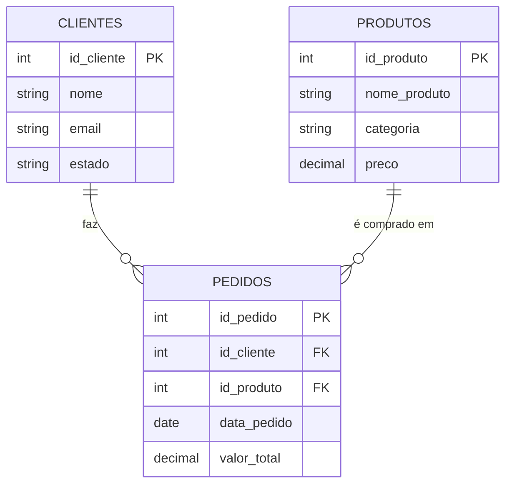

# SQL na prática: juntando tabelas

No capítulo anterior a gente aprendeu a resumir dado com `COUNT`, `SUM`, `GROUP BY` e `HAVING`. Só que toda consulta que fizemos até agora rodou dentro de uma tabela só, a de pedidos. Isso é uma limitação real: pergunta de negócio de verdade quase sempre precisa de dado que está espalhado em mais de uma tabela. O nome do cliente mora na tabela de clientes. Qual produto ele comprou mora em outro lugar. Se eu quero uma resposta que junte as duas coisas, preciso de um jeito de cruzar tabela com tabela dentro da própria consulta. É isso que esse capítulo resolve.

## O que é JOIN, antes de qualquer sintaxe

`JOIN` é o comando que junta linha de uma tabela com linha de outra tabela, baseado numa relação que já existe entre elas: a mesma chave primária e chave estrangeira que a gente viu lá no capítulo 1. Se a tabela de pedidos tem uma coluna `id_cliente` que aponta pra chave primária da tabela de clientes, `JOIN` é o comando que usa esse apontamento pra trazer, numa consulta só, dado das duas tabelas ao mesmo tempo.

Sem `JOIN`, a alternativa seria fazer isso na mão: rodar uma consulta na tabela de pedidos, pegar o `id_cliente` de cada linha, e ir atrás desse `id_cliente` na tabela de clientes, um por um. Funciona pra três linhas. Não funciona pra três milhões. `JOIN` existe justamente pra tirar esse trabalho manual das suas costas e deixar o banco fazer esse cruzamento de forma eficiente.

(Se você já usou PROCV ou PROC-X no Excel pra buscar uma informação numa tabela a partir de outra, você já fez, na prática, um JOIN informal, só que sem esse nome formal.)

## A tabela de produtos entra em cena

Lá no capítulo 1, quando eu expliquei o que é uma tabela, cheguei a citar de passagem uma tabela de produtos, mas nunca chegamos a usar ela de verdade. Chegou a hora.

| id_produto | nome_produto | categoria | preco |
|---|---|---|---|
| 1 | Fone de Ouvido | Eletrônicos | 150.00 |
| 2 | Caneca Térmica | Casa | 45.00 |
| 3 | Mochila | Acessórios | 210.00 |
| 4 | Teclado Mecânico | Eletrônicos | 320.00 |

Pra ligar produto a pedido sem precisar criar uma tabela nova só pra isso (uma tabela de "itens do pedido", que permitiria um pedido ter vários produtos, é complexidade demais pra esse capítulo), vou usar uma simplificação didática: a tabela de pedidos ganha uma coluna nova, `id_produto`, tratando cada pedido como se fosse a compra de um produto só. Não é assim que loja online de verdade costuma funcionar, mas serve bem pro que a gente precisa aprender aqui.

| id_pedido | id_cliente | data_pedido | valor_total | id_produto |
|---|---|---|---|---|
| 101 | 1 | 2026-08-02 | 150.00 | 1 |
| 102 | 2 | 2026-08-10 | 89.90 | 2 |
| 103 | 1 | 2026-09-01 | 320.00 | 3 |
| 104 | 3 | 2026-09-05 | 45.00 | 2 |
| 105 | 1 | 2026-09-12 | 210.00 | 3 |
| 106 | 4 | 2026-09-15 | 150.00 | 1 |

Repara que em dois pedidos (102 e 103) o `valor_total` não bate exatamente com o `preco` do produto associado. Não vou me preocupar com isso agora, pensa que pode ter desconto, frete, ou preço que mudou desde a compra, isso foge do escopo desse capítulo.

Também vou aproveitar e adicionar mais um cliente na base, um que nunca fez nenhum pedido:

| id_cliente | nome | email | estado |
|---|---|---|---|
| 1 | Ana Souza | ana@email.com | SP |
| 2 | Bruno Lima | bruno@email.com | RJ |
| 3 | Carla Dias | carla@email.com | SP |
| 4 | Diego Martins | diego@email.com | MG |
| 5 | Elisa Ferreira | elisa@email.com | PR |

Repara que o `Teclado Mecânico` (id_produto 4) nunca aparece na coluna `id_produto` de nenhum pedido, e a Elisa (id_cliente 5) nunca aparece na coluna `id_cliente` de nenhum pedido. Isso é proposital, os dois vão servir pra deixar bem claro, mais na frente, o que cada tipo de `JOIN` faz quando não existe correspondência entre as tabelas.

## Atualizando o diagrama de relacionamento

Com a tabela de produtos em cena, o diagrama de entidade-relacionamento que a gente desenhou no capítulo 2 ganha uma peça nova:



Agora a tabela de pedidos tem duas chaves estrangeiras: uma apontando pra cliente, outra apontando pra produto. São exatamente essas duas relações que `JOIN` vai usar.

## Os quatro tipos de JOIN, antes do código

Existem quatro tipos principais de `JOIN`, e a diferença entre eles é só uma coisa: o que acontece quando uma linha de um lado não tem correspondência do outro lado.

- **INNER JOIN** só traz a linha quando existe correspondência nas duas tabelas. Se não tem correspondência, a linha simplesmente não aparece no resultado, de nenhum dos dois lados.
- **LEFT JOIN** traz todas as linhas da tabela da esquerda (a primeira que você menciona na consulta), tenha correspondência ou não. Quando não tem correspondência do lado direito, as colunas daquela tabela aparecem em branco (`NULL`).
- **RIGHT JOIN** é o espelho do LEFT JOIN: traz todas as linhas da tabela da direita, tenha correspondência ou não, preenchendo com `NULL` as colunas da esquerda quando faltar.
- **FULL JOIN** traz todas as linhas das duas tabelas, com correspondência ou não, preenchendo com `NULL` o lado que faltar, seja ele qual for.

Resumindo numa tabela:

| Tipo de JOIN | O que mantém | O que acontece sem correspondência |
|---|---|---|
| INNER JOIN | Só linha que tem correspondência nas duas tabelas | Linha sem correspondência simplesmente some, dos dois lados |
| LEFT JOIN | Toda linha da tabela da esquerda | Linha da esquerda sem correspondência aparece mesmo assim, com NULL do lado direito |
| RIGHT JOIN | Toda linha da tabela da direita | Linha da direita sem correspondência aparece mesmo assim, com NULL do lado esquerdo |
| FULL JOIN | Toda linha das duas tabelas | Linha sem correspondência de qualquer lado aparece, com NULL do lado que faltar |

Com isso na cabeça, agora sim, vamos pra sintaxe.

## INNER JOIN: só o que bate nos dois lados

A sintaxe básica é:

```sql
SELECT coluna1, coluna2
FROM tabela_a
INNER JOIN tabela_b ON tabela_a.coluna_chave = tabela_b.coluna_chave;
```

O `ON` é a parte nova: é ali que você diz qual coluna de cada tabela representa a mesma relação, geralmente a chave primária de uma batendo com a chave estrangeira da outra.

Se eu quiser o nome do cliente ao lado de cada pedido que ele fez:

```sql
SELECT clientes.nome, clientes.estado, pedidos.id_pedido, pedidos.valor_total
FROM clientes
INNER JOIN pedidos ON clientes.id_cliente = pedidos.id_cliente;
```

Resultado:

| nome | estado | id_pedido | valor_total |
|---|---|---|---|
| Ana Souza | SP | 101 | 150.00 |
| Ana Souza | SP | 103 | 320.00 |
| Ana Souza | SP | 105 | 210.00 |
| Bruno Lima | RJ | 102 | 89.90 |
| Carla Dias | SP | 104 | 45.00 |
| Diego Martins | MG | 106 | 150.00 |

Repara que a Elisa Ferreira não aparece em lugar nenhum desse resultado. Ela existe na tabela de clientes, mas como nunca fez pedido, não existe correspondência do lado de pedidos, e `INNER JOIN` descarta qualquer linha sem correspondência dos dois lados.

## LEFT JOIN: mantendo tudo da tabela da esquerda

E se eu quiser justamente o oposto: ver todo cliente, mesmo o que nunca fez pedido? É pra isso que existe o `LEFT JOIN`. A sintaxe é praticamente igual, só troca a palavra:

```sql
SELECT clientes.nome, pedidos.id_pedido, pedidos.valor_total
FROM clientes
LEFT JOIN pedidos ON clientes.id_cliente = pedidos.id_cliente;
```

Resultado:

| nome | id_pedido | valor_total |
|---|---|---|
| Ana Souza | 101 | 150.00 |
| Ana Souza | 103 | 320.00 |
| Ana Souza | 105 | 210.00 |
| Bruno Lima | 102 | 89.90 |
| Carla Dias | 104 | 45.00 |
| Diego Martins | 106 | 150.00 |
| Elisa Ferreira | NULL | NULL |

Agora a Elisa aparece. Como `clientes` é a tabela da esquerda (a primeira depois do `FROM`), `LEFT JOIN` garante que toda linha dela apareça no resultado, mesmo sem nenhum pedido correspondente. As colunas que viriam de `pedidos` ficam com `NULL`, porque não existe pedido nenhum pra preencher ali.

## RIGHT JOIN: mantendo tudo da tabela da direita

`RIGHT JOIN` faz o mesmo raciocínio, só que garantindo toda linha da tabela da direita. Vamos usar ele pra cruzar pedido com produto, e ver todo produto do catálogo, mesmo o que nunca foi comprado:

```sql
SELECT produtos.nome_produto, pedidos.id_pedido, pedidos.valor_total
FROM pedidos
RIGHT JOIN produtos ON pedidos.id_produto = produtos.id_produto;
```

Resultado:

| nome_produto | id_pedido | valor_total |
|---|---|---|
| Fone de Ouvido | 101 | 150.00 |
| Caneca Térmica | 102 | 89.90 |
| Mochila | 103 | 320.00 |
| Caneca Térmica | 104 | 45.00 |
| Mochila | 105 | 210.00 |
| Fone de Ouvido | 106 | 150.00 |
| Teclado Mecânico | NULL | NULL |

O `Teclado Mecânico` aparece com `NULL` nas colunas de pedido, porque nenhum pedido tem `id_produto = 4`. Ele existe no catálogo (tabela da direita), e `RIGHT JOIN` garante que toda linha dela apareça, mesmo sem venda nenhuma associada.

## FULL JOIN: os dois lados garantidos

`FULL JOIN` é a combinação natural dos dois anteriores: garante toda linha da esquerda e toda linha da direita, com `NULL` preenchendo o lado que faltar em cada caso. A sintaxe segue o mesmo padrão:

```sql
SELECT clientes.nome, pedidos.id_pedido
FROM clientes
FULL JOIN pedidos ON clientes.id_cliente = pedidos.id_cliente;
```

Com os dados que a gente tem, esse resultado ficaria parecido com o do `LEFT JOIN` de mais cedo (a Elisa aparecendo com `NULL`), porque nossa tabela de pedidos não tem nenhuma linha órfã, sem cliente correspondente. Mas se existisse, `FULL JOIN` traria ela também, com `NULL` do lado do cliente. Ele é o tipo mais completo: nada se perde de nenhum dos dois lados.

## Juntando tudo num exemplo só

Lá no capítulo 1, quando eu expliquei por que SQL existe, usei um exemplo de pergunta de negócio que só dava pra responder cruzando tabela: "quais clientes fizeram mais de três pedidos". Agora, com `JOIN`, `GROUP BY` e `HAVING` na mão, dá pra responder uma pergunta parecida, e trazer o nome do cliente junto: "nome de cada cliente e quanto ele gastou no total, só os que gastaram mais de R$300, do maior gasto pro menor".

```sql
SELECT clientes.nome, SUM(pedidos.valor_total) AS total_gasto
FROM clientes
JOIN pedidos ON clientes.id_cliente = pedidos.id_cliente
GROUP BY clientes.id_cliente, clientes.nome
HAVING SUM(pedidos.valor_total) > 300
ORDER BY total_gasto DESC;
```

Resultado:

| nome | total_gasto |
|---|---|
| Ana Souza | 680.00 |

Repara na ordem das peças: primeiro o `JOIN` traz o nome do cliente pra dentro da mesma consulta que tem o valor dos pedidos, depois `GROUP BY` resume por cliente, `HAVING` filtra quem passou de R$300, e `ORDER BY` ordena o resultado. Usei `JOIN` sozinho ali, sem escrever `INNER JOIN` por extenso, porque `INNER JOIN` é o tipo padrão, e é isso que o banco assume quando você só escreve `JOIN`. Faz sentido aqui: eu só quero cliente que efetivamente tem pedido, então não preciso do `LEFT JOIN` trazendo a Elisa com `NULL` pra dentro dessa conta.

## Fechando esse capítulo

Com `JOIN`, a gente finalmente consegue responder pergunta de negócio espalhada em mais de uma tabela, sem precisar cruzar ID na mão. `INNER JOIN` pra correspondência garantida, `LEFT` e `RIGHT JOIN` pra garantir todas as linhas de um lado específico, `FULL JOIN` pra garantir os dois lados de uma vez.

Só que repara numa coisa: em todo esse módulo, desde o primeiro capítulo, a gente só leu dado que já existia. Nunca criamos uma tabela do zero, nunca inserimos um pedido novo, nunca corrigimos um valor errado, nunca apagamos nada. É exatamente esse o assunto do último capítulo dessa sequência de SQL: `CREATE TABLE`, `INSERT`, `UPDATE` e `DELETE`, o lado de criar e modificar dado, não só de consultar.
