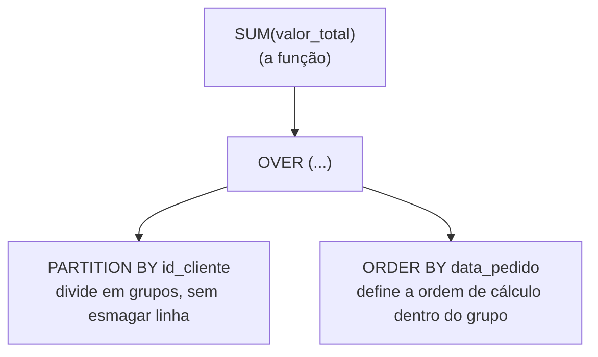

# SQL na prática: window functions

Imagina uma turma de alunos, cada um com uma nota numa prova. Se eu rodar `GROUP BY turma` com `AVG(nota)`, o resultado me dá um número só por turma: a média. Ótimo, se é só isso que eu preciso. Mas repara no que eu perco no caminho: depois de agrupar, não sobra mais nenhuma linha individual de aluno, só o resumo do grupo inteiro. Se a pergunta fosse "qual a nota de cada aluno, e qual a média da turma dele, lado a lado, na mesma linha", `GROUP BY` sozinho não responde. Ele esmaga a linha do aluno assim que agrupa, e não tem como voltar atrás dentro da mesma consulta.

Isso não é novidade nesse repositório. Lá no capítulo de agregação, quando calculamos quanto cada cliente gastou no total, ficou um gancho pendente: existe um jeito de calcular esse tipo de métrica sem perder a linha individual de cada pedido? Existe, e esse capítulo resolve exatamente isso: window function.

## O que é uma window function

Uma **window function** calcula uma métrica (soma, média, posição num ranking, o que for) olhando pra um grupo de linhas relacionadas, a "janela", sem esmagar essas linhas num resultado único. Cada linha original continua existindo no resultado, só que agora com uma coluna nova ao lado, carregando o valor que a window function calculou pra aquela janela.

A estrutura de uma window function tem sempre as mesmas peças: uma função (a conta que você quer fazer), a cláusula `OVER`, que é o que transforma uma função comum numa window function, e dentro dela, opcionalmente, `PARTITION BY` (que divide o resultado em grupos) e `ORDER BY` (que define a ordem de cálculo dentro de cada grupo).



Repara na diferença central pro `GROUP BY`: lá, agrupar e calcular a métrica andam juntos e o resultado final tem uma linha por grupo. Aqui, `OVER` calcula a métrica olhando pro grupo, mas devolve o resultado grudado em cada linha original, sem reduzir quantidade de linha nenhuma.

## PARTITION BY e ORDER BY: a janela sem esmagar linha

`PARTITION BY` faz o mesmo trabalho de dividir em grupo que `GROUP BY` já fazia: você diz qual coluna define cada grupo (tipo `id_cliente`), e o banco separa as linhas de acordo com isso. A diferença é que `PARTITION BY` não reduz a quantidade de linha do resultado. Ele só diz "quando for calcular a métrica pra essa linha, olha só pras outras linhas do mesmo grupo dela", sem apagar nenhuma linha no processo.

`ORDER BY` dentro da window function faz um trabalho diferente do `ORDER BY` que a gente já conhece lá do capítulo de consulta. Aquele `ORDER BY`, no fim da consulta, só decide a ordem em que as linhas do resultado aparecem na tela. Esse aqui, dentro do `OVER`, decide a ordem em que o banco processa as linhas *durante* o cálculo da métrica, dentro de cada partição. Isso importa demais quando a métrica depende de ordem, como um total acumulado: sem `ORDER BY` dentro do `OVER`, o banco não teria como saber qual linha vem "antes" da outra pra ir somando aos poucos.

## Trade-offs

Duas coisas vale ter em mente antes de sair usando window function em tudo.

A primeira é suporte: nem todo banco implementa window function do mesmo jeito, e nem sempre teve isso desde sempre. MySQL, por exemplo, só ganhou suporte decente a window function na versão 8, lançada em 2018, bem depois de outros bancos já terem isso maduro. Isso conecta direto com o capítulo 2 desse módulo, onde a gente escolheu o PostgreSQL como banco principal desse repositório: PostgreSQL suporta window function de forma sólida há mais de uma década, então não é uma preocupação aqui. Mas se um dia você for trabalhar num banco legado, ou numa versão antiga de outro SGBD, vale checar se o recurso existe antes de contar com ele.

A segunda é custo computacional: window function tende a ser mais pesada de processar do que uma agregação simples com `GROUP BY`, porque o banco precisa manter e processar cada linha individual, em vez de já ir reduzindo o resultado conforme agrupa. Isso não quer dizer "evite window function", quer dizer "não troque `GROUP BY` por window function por hábito, sem motivo". A mensagem certa é: use window function especificamente quando você precisa manter o detalhe da linha e não pode se dar ao luxo de perder granularidade agregando o dado. Se tudo que você precisa é o resumo por grupo, sem a linha individual, `GROUP BY` continua sendo a ferramenta certa, mais simples e mais barata.

## Exemplo prático

Vamos resolver, de vez, o gancho que ficou pendente desde o capítulo de agregação: quanto cada cliente gastou, acumulado pedido a pedido, sem perder a linha de cada pedido individual.

```sql
SELECT id_pedido, id_cliente, data_pedido, valor_total,
       SUM(valor_total) OVER (PARTITION BY id_cliente ORDER BY data_pedido) AS total_acumulado
FROM pedidos
ORDER BY id_cliente, data_pedido;
```

`PARTITION BY id_cliente` separa os pedidos por cliente, `ORDER BY data_pedido` dentro do `OVER` diz pro banco somar os pedidos na ordem cronológica de cada cliente, e `SUM(valor_total) OVER (...)` vai acumulando o total conforme percorre essa ordem.

Resultado:

| id_pedido | id_cliente | data_pedido | valor_total | total_acumulado |
|---|---|---|---|---|
| 101 | 1 | 2026-08-02 | 150.00 | 150.00 |
| 103 | 1 | 2026-09-01 | 320.00 | 470.00 |
| 105 | 1 | 2026-09-12 | 210.00 | 680.00 |
| 102 | 2 | 2026-08-10 | 89.90 | 89.90 |
| 104 | 3 | 2026-09-05 | 45.00 | 45.00 |
| 106 | 4 | 2026-09-15 | 150.00 | 150.00 |

Repara que continuam sendo seis linhas, uma por pedido, exatamente como na tabela original. Nenhuma linha foi esmagada. E o total acumulado da última linha de cada cliente bate exatamente com o `total_gasto` que a gente já tinha calculado lá no capítulo de agregação com `GROUP BY` (Ana Souza 680.00, Bruno Lima 89.90, Carla Dias 45.00, Diego Martins 150.00), só que agora a gente enxerga também o caminho até chegar lá, pedido por pedido, em vez de só o número final.

## Outras funções que você vai encontrar por aí

`SUM() OVER` foi só uma das funções que dá pra usar dentro de `OVER`. Praticamente qualquer função de agregação que a gente já viu (`COUNT`, `AVG`, `MIN`, `MAX`) funciona do mesmo jeito, bastando colocar `OVER (...)` depois dela.

Existem também funções feitas especificamente pra rodar dentro de uma window function, sem existir fora desse contexto. As duas mais comuns são `ROW_NUMBER()`, que numera cada linha dentro da sua partição, em ordem sequencial e sem empate nunca (1, 2, 3, sempre únicos), e `RANK()`, que também numera, mas permite empate quando o valor usado no `ORDER BY` é igual, e nesse caso pula o número seguinte (tipo 1, 2, 2, 4). Não vou destrinchar cada uma agora, só fica registrado que elas existem e seguem a mesma estrutura de `PARTITION BY` e `ORDER BY` que a gente acabou de aprender.

## Fechando esse capítulo

Com window function, a gente resolve o problema que ficou pendente desde a agregação: calcular métrica em cima de um grupo de linha sem perder o detalhe da linha individual. É uma ferramenta mais pesada que `GROUP BY`, então vale usar quando o detalhe da linha realmente importa pra resposta.

Esse foi o penúltimo capítulo de SQL desse módulo. Falta uma peça: até aqui, todo `INSERT`, `UPDATE` e `DELETE` que a gente rodou foi tratado como um comando isolado, que já vale sozinho assim que roda. Mas e se eu precisar que vários comandos aconteçam juntos, todos ou nenhum, sem deixar o banco pela metade se algo der errado no meio do caminho? Isso é assunto do último capítulo desse módulo: transações.
