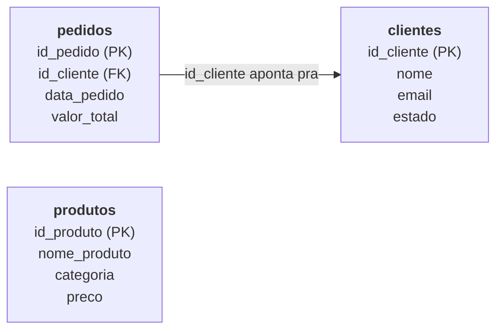

# Onde o dado mora: bancos de dados relacionais e SQL

Nos módulos anteriores a gente entendeu o que é engenharia de dados e o ciclo de vida que todo dado percorre (geração, armazenamento, ingestão, transformação, disponibilização). E no capítulo anterior a gente viu que dado vem de um monte de fonte diferente, mas que toda fonte, cedo ou tarde, precisa de um lugar pra descansar e virar algo consultável. Chegou a hora de conhecer esse lugar de perto: o reservatório mais maduro e mais comum que existe, onde a imensa maioria do dado de empresa mora até hoje. O banco de dados relacional.

## Antes de existir banco de dados, como é que isso funcionava?

Antes de bancos de dados relacionais existirem, dado ficava guardado em arquivo solto. Um arquivo de texto aqui, uma planilha ali, cada sistema com o formato que bem entendesse. Parece bobo hoje, mas pensa no problema que isso gera: se o sistema de vendas guarda cliente num arquivo, e o sistema financeiro guarda cliente em outro arquivo, com outro formato, quem garante que o "João Silva" de um é o mesmo "João Silva" do outro? Quem impede alguém de digitar o mesmo cliente duas vezes, com o nome escrito diferente nas duas vezes? Quem garante que, se o sistema desligar no meio de uma operação, o dado não fica pela metade, corrompido?

Nenhum desses arquivos soltos resolvia isso de forma confiável. Cada aplicação reinventava a própria lógica de guardar e buscar dado, e cada uma reinventava também os próprios bugs. Faltava uma forma padronizada, confiável e eficiente de guardar dado estruturado, que qualquer sistema pudesse usar sem ter que resolver os mesmos problemas de novo.

## Então, o que é um banco de dados relacional?

Um banco de dados relacional é, no fim das contas, aquele reservatório tratado do capítulo anterior: um jeito de organizar dado em tabelas, e conectar essas tabelas entre si através de relações. Daí o nome "relacional": o valor não está apenas em cada tabela isolada, está em como as tabelas se relacionam umas com as outras.

Em vez de guardar tudo bagunçado num arquivo só, você separa o dado por assunto. Uma tabela de clientes. Uma tabela de produtos. Uma tabela de pedidos. E aí, em vez de repetir a informação inteira do cliente dentro de cada pedido, você só referencia qual cliente fez aquele pedido. Isso evita repetição de dado, evita inconsistência, e deixa muito mais fácil garantir que o dado ali dentro faça sentido. É água que já chega estruturada, organizada e tratada, não um balde de qualquer coisa.

Além disso, banco de dados relacional já nasce resolvendo, de fábrica, um monte de problema que arquivo solto não resolvia: controle de quem pode acessar o quê, garantia de que uma operação não fica pela metade se algo der errado no meio do caminho, e um jeito padronizado de buscar exatamente o dado que você precisa, sem ter que vasculhar arquivo por arquivo.

## Tabela, linha e coluna: o vocabulário básico

Se você já mexeu em planilha (e se não mexeu, recomendo fortemente aprender isso antes, como já bati nessa tecla no módulo anterior), você já conhece a lógica de tabela, mesmo sem saber que tinha esse nome.

Uma **tabela** é, basicamente, a versão de banco de dados de uma planilha. Ela guarda dado sobre um assunto específico. Uma tabela de clientes, por exemplo.

Cada **linha** dessa tabela representa um registro único daquele assunto. Uma linha na tabela de clientes é um cliente específico. Se você tem 500 clientes, sua tabela tem 500 linhas.

Cada **coluna** representa um atributo daquele registro. Na tabela de clientes, você teria colunas como nome, e-mail, data de cadastro, telefone. Toda linha daquela tabela tem essas mesmas colunas preenchidas (ou, às vezes, deixadas em branco quando a informação não existe).

Junta tudo isso e você tem uma tabela: um conjunto de linhas, cada uma com as mesmas colunas, guardando dado organizado sobre um assunto específico.

## Chave primária: como identificar uma linha sem ambiguidade

Agora vem um problema real: como o banco garante que ele está falando da linha certa, sem confundir um cliente com outro? Nome não serve, porque pode ter dois "João Silva" na sua base. E-mail até poderia servir, mas e se o cliente trocar de e-mail?

É pra isso que existe a **chave primária**: uma coluna (ou combinação de colunas) que identifica aquela linha de forma única, sem ambiguidade nenhuma, e que nunca muda depois de criada. Geralmente é um número gerado automaticamente pelo próprio banco, tipo um "ID do cliente", que não tem nenhum significado de negócio, ele só serve pra dizer "essa linha aqui, e nenhuma outra".

Toda tabela bem projetada tem uma chave primária. É o jeito do banco (e de você) apontar pra um registro específico sem margem pra erro.

## Chave estrangeira: como uma tabela conversa com a outra

Lembra que eu falei que o valor do banco relacional está em como as tabelas se relacionam? A **chave estrangeira** é exatamente o mecanismo que cria essa relação.

Imagina a tabela de pedidos. Cada pedido foi feito por um cliente. Em vez de copiar todos os dados daquele cliente (nome, e-mail, telefone) dentro de cada linha da tabela de pedidos, o que seria um desperdício enorme e um convite pra inconsistência, a tabela de pedidos só guarda uma coluna com o ID daquele cliente, o mesmo ID que é a chave primária lá na tabela de clientes.

Pra ficar concreto, pensa na Ana Souza, uma cliente que fez três pedidos (o 101, o 103 e o 105). Sem chave estrangeira, cada uma dessas três linhas de pedido carregaria junto "Ana Souza, ana@email.com", a mesma informação copiada três vezes. Com chave estrangeira, as três linhas guardam só o número 1 na coluna `id_cliente`, e o nome e o e-mail da Ana moram num lugar só: na tabela de clientes.

Essa coluna, que aponta pra chave primária de outra tabela, é a chave estrangeira. É o cano que liga o reservatório de pedidos ao reservatório de clientes, sem precisar duplicar água nenhuma no caminho. Se o cliente mudar de telefone, você atualiza um lugar só, a tabela de clientes, e todo pedido antigo dele continua automaticamente "apontando" pro cliente certo, com o telefone atualizado.

E tem mais um trabalho que a chave estrangeira faz, meio escondido: ela impede pedido órfão. Se alguém tentar gravar um pedido com `id_cliente` igual a 99, e não existe cliente 99 na tabela de clientes, o banco recusa. Não dá pra ter pedido apontando pra cliente que não existe. O cano não pode ser ligado num reservatório fantasma.

Juntando tudo, as três tabelas que vão acompanhar a gente nos próximos capítulos ficam assim:

Cada caixa é uma tabela, com as colunas dentro. PK marca a chave primária, FK marca a chave estrangeira, e a seta é o cano: a coluna `id_cliente` de pedidos aponta pra chave primária de clientes. Produtos fica sozinho por enquanto.

## Trade-offs: banco relacional resolve tudo?

Não, e é importante já plantar essa semente aqui, mesmo sem aprofundar agora. Banco de dados relacional é ótimo pra dado estruturado, onde você sabe de antemão o formato que ele vai ter (colunas fixas, tipo definido). Ele também é ótimo quando consistência é prioridade máxima, tipo em sistema financeiro, onde você não pode se dar ao luxo de ter dado contraditório.

Só que existem cenários onde ele não é a melhor escolha: volume gigantesco de dado não estruturado (tipo log de aplicação, ou documento com formato variável), ou situação onde performance de escrita em escala absurda importa mais do que estrutura rígida. Pra esses casos existem outras famílias de banco de dados, os chamados bancos "NoSQL", que a gente ainda não vai destrinchar aqui, mas que valem uma menção: eles existem porque banco relacional, apesar de excelente, não é bala de prata pra tudo.

## E como eu falo com esse banco? (SQL entra em cena)

Beleza, o reservatório tá montado: dado organizado em tabela, cada linha com sua chave, tabela ligada com tabela. Só que surge uma pergunta prática: como eu, ser humano, pergunto pra esse banco alguma coisa? Como eu peço "me mostra todos os clientes que compraram mais de uma vez"?

É exatamente esse buraco que o **SQL** (Structured Query Language, ou "linguagem de consulta estruturada") veio preencher. SQL é a linguagem criada especificamente pra conversar com banco de dados relacional: pedir dado, inserir dado novo, atualizar dado existente, apagar o que não serve mais, e definir a própria estrutura das tabelas.

## O que existia antes do SQL, e por que não era suficiente

Antes do SQL virar padrão, cada fabricante de banco de dados tinha a própria linguagem, o próprio jeito de fazer consulta, geralmente mais parecido com escrever um programa passo a passo (tipo "abra o arquivo, procure linha por linha, compare esse valor, retorne se bater") do que simplesmente descrever o que você queria.

O problema disso é duplo. Primeiro, quem aprendia a mexer num banco não conseguia usar esse conhecimento em outro banco de fabricante diferente, porque a lógica de acesso era toda proprietária. Segundo, e mais importante: você precisava descrever o *como* buscar o dado, passo a passo, em vez de simplesmente descrever *o que* você queria. Isso é lento de escrever, difícil de otimizar, e exige que quem escreve a consulta entenda profundamente a estrutura interna do banco.

## Por que SQL "pegou" e virou padrão da indústria

SQL resolveu isso virando uma linguagem **declarativa**: você descreve *o que* quer ("me dê o nome de todo cliente que fez pedido em outubro"), e é o próprio banco de dados que decide *como* buscar esse dado da forma mais eficiente possível. Você não precisa saber se o banco vai varrer a tabela inteira ou usar algum atalho interno pra achar o dado mais rápido, isso é problema do banco resolver, não seu.

Isso, somado ao fato de SQL ter virado um padrão adotado (com pequenas variações) pela imensa maioria dos fabricantes de banco relacional, fez com que aprender SQL uma vez te desse a base pra trabalhar com praticamente qualquer banco relacional do mercado, seja ele qual for. Isso é raro em tecnologia, e é uma das razões de SQL continuar tão relevante décadas depois de ter sido criado.

## Exemplo prático (sem código ainda)

Vamos voltar pra loja online que já usamos de exemplo nos módulos anteriores. Ela tem uma tabela de clientes e uma tabela de pedidos, ligadas pela chave estrangeira que a gente acabou de ver.

Agora imagina que o dono da loja quer saber: "quais clientes fizeram mais de três pedidos nos últimos seis meses?". Repara que essa pergunta não dá pra responder olhando só uma tabela isolada. Você precisa olhar a tabela de pedidos, contar quantos pedidos cada cliente fez, filtrar pelos últimos seis meses, e depois cruzar esse resultado com a tabela de clientes pra pegar o nome de cada um.

Fazer isso na mão, abrindo arquivo e contando linha por linha, seria uma tortura, e ficaria pior à medida que a loja crescesse. É exatamente esse tipo de pergunta que SQL foi feito pra responder: você descreve a pergunta numa estrutura que o banco entende, e ele devolve a resposta, não importa se são 500 ou 5 milhões de pedidos na tabela.

## Fechando esse capítulo

Então é isso: banco de dados relacional é o reservatório onde o dado mora, organizado em tabela, linha e coluna, conectado por chave primária e chave estrangeira. E SQL é a linguagem que existe pra você conversar com esse banco, descrevendo o que você quer sem precisar ensinar o banco a fazer o trabalho pesado.

Só que reservatório sem válvula não adianta de nada. A água tá lá, organizadinha, e você não consegue tirar nem um copo. É isso que o SQL resolve. Mas antes de abrir a primeira válvula, o reservatório precisa existir na sua máquina, e é por aí que o próximo capítulo começa: qual programa efetivamente executa o SQL, quais são as principais opções do mercado, e como deixar um banco rodando no seu computador.
