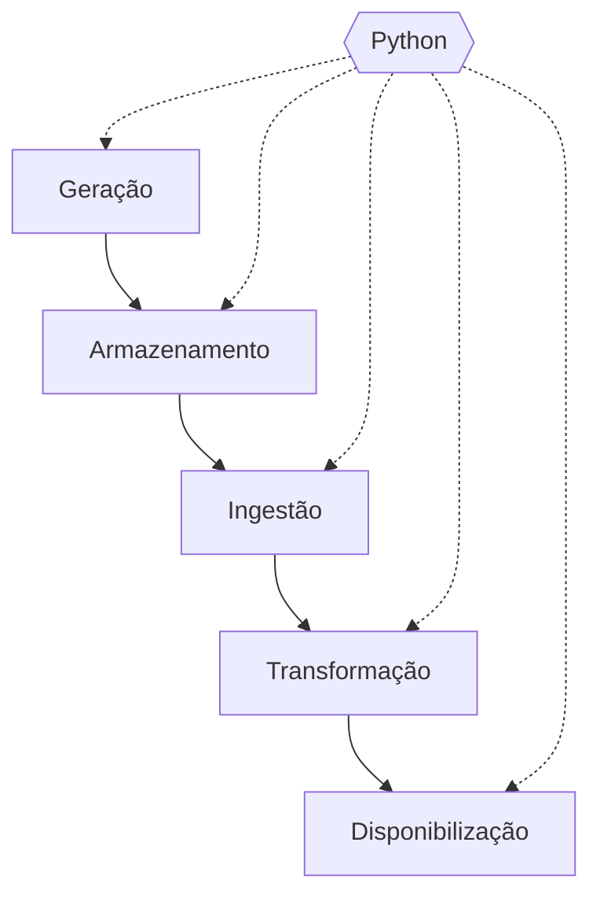

# Python: a caixa de ferramentas do engenheiro de dados

No módulo anterior a gente entendeu onde o dado mora e como conversar com ele usando SQL. Agora vem o próximo passo do roadmap, e ele tem um motivo pra estar exatamente nessa posição. SQL é excelente pra guardar, consultar e transformar dado que já está dentro de um banco. Só que o ciclo de vida da engenharia de dados começa antes disso (o dado precisa chegar até o banco) e termina depois (o dado precisa ser entregue pra alguém). E tem muita lógica no meio do caminho que SQL sozinho não resolve, ou não resolve de forma elegante. Pra isso, a gente precisa de uma linguagem de programação de verdade, e a escolha praticamente unânime da área é Python.

## O que é Python, rapidinho

Python é uma linguagem de programação de **propósito geral**, ou seja, não foi criada só pra dado. Dá pra usar pra site, automação, jogo, inteligência artificial, e por aí vai. Também é considerada de **alto nível**, o que na prática quer dizer que você escreve o código num jeito bem próximo de como pensa, sem se preocupar com os detalhes internos de como o computador executa aquilo.

E a característica pela qual ela é mais conhecida é a **legibilidade**: um código Python, mesmo escrito por outra pessoa, costuma ser possível de ler e entender sem muito esforço. Isso parece detalhe, mas pesa bastante, principalmente pra quem está começando.

## Por que Python, e não Java, C ou outra?

Existem várias linguagens de programação, então a pergunta é justa. Sem entrar em benchmark técnico, três motivos explicam a escolha.

**Legibilidade.** Compara um código Python com o equivalente em Java ou C. Em geral o de Python é mais curto e mais parecido com uma frase em inglês simples. Menos símbolo, menos cerimônia, menos coisa pra decorar só pra fazer o programa rodar.

**Curva de aprendizado mais suave.** Consequência direta do ponto anterior. Você chega mais rápido no ponto de escrever algo útil, e isso importa muito quando quem está aprendendo (como eu, e provavelmente como você) não vem de uma formação em computação e está estudando nas horas vagas.

**Ecossistema gigante de biblioteca pronta pra dado.** Esse é o motivo mais pesado dos três. Biblioteca é código que outras pessoas já escreveram e compartilharam, e que você reaproveita em vez de escrever do zero. Pra praticamente qualquer coisa que você precise fazer com dado, existe uma biblioteca Python pronta.

Vou ser sincero sobre o trade-off, no mesmo tom do roadmap do módulo 1: Python não é a linguagem mais rápida do mundo. C e Java rodam mais rápido em muita situação. Só que, pra maior parte do trabalho de engenharia de dados, o gargalo raramente é a velocidade da linguagem em si, e a vantagem de escrever rápido e ter biblioteca pronta compensa de longe.

## A analogia da caixa de ferramentas

Lembra das cinco etapas do ciclo de vida, lá do capítulo 2 do módulo 1? Geração, armazenamento, ingestão, transformação e disponibilização. Cada uma tem ferramentas que são melhores nela do que Python. Pra armazenar, um banco de dados relacional é melhor. Pra transformar dado dentro de um banco, SQL costuma ser mais direto. Pra entregar dado em relatório visual, existem ferramentas próprias pra isso.

Então por que Python, e não uma ferramenta especializada por etapa? Você já deve ter ouvido Python sendo chamado de canivete suíço por aí. A imagem pega, mas não é tão precisa assim. Canivete faz tudo meio capenga: a lâmina não corta como faca de verdade, a tesourinha mal dá conta de uma unha, e ninguém em sã consciência abre uma lata de molho com aquele abridor se tiver outra opção na gaveta. Essa não é a força do Python.

A imagem mais honesta é a de uma **caixa de ferramentas**. Todo profissional tem a sua, e nenhuma caixa cobre tudo que existe no mundo. A do eletricista não é a do encanador, que não é a de quem mexe com carro. Ninguém carrega a caixa de ferramentas do universo inteiro, até porque isso nem existe. Python é assim: quase nunca é a melhor ferramenta pra uma tarefa isolada e específica, mas serve pra montar praticamente qualquer caixa que você precisar.

E isso deixa o recorte desse módulo bem mais claro. Ele não vai te entregar "a caixa inteira de Python", porque a linguagem é usada pra tudo e essa caixa não fecha nunca. Vai te entregar a caixa do encanador: as ferramentas de quem constrói e mantém os canos por onde o dado passa, lembrando lá do capítulo 1 do módulo 1. Python não é a água nem o cano. É o que está na mão de quem constrói e cuida do sistema.

Na prática, isso significa coisas assim: Python pode simular ou gerar dado de teste (geração), gravar e ler dado num banco (armazenamento), buscar dado numa API ou num arquivo e trazer pra dentro dos seus sistemas (ingestão), limpar e calcular em cima do dado (transformação), e mandar o resultado pra onde alguém vai usar (disponibilização). Nenhuma dessas tarefas é exclusiva de Python, mas é raro encontrar outra linguagem que apareça em todas elas com tanta naturalidade.

## Por que isso importa pra engenharia de dados

Além da analogia, tem três motivos bem concretos.

**Comunidade enorme.** Muita gente usando significa muita gente que já esbarrou no mesmo problema que você. Quando você travar (e vai travar), a chance de existir uma resposta escrita por aí, inclusive em português, é alta.

**Biblioteca pronta pra praticamente tudo.** Ler arquivo, manipular tabela, conversar com banco, chamar uma API, conectar com serviço de nuvem. Em vez de escrever do zero, você usa o que já existe e foca no problema do seu dado.

**Ferramentas centrais da área são escritas em Python ou têm integração nativa com ele.** O exemplo mais claro é o Airflow, a ferramenta de orquestração que vem mais pra frente no roadmap: as tarefas dele são definidas em código Python. Aprender Python agora é, ao mesmo tempo, preparar terreno pra conseguir usar o que vem depois.

## O que esse módulo vai ensinar (e o que não vai)

O critério de corte aqui é simples: **só o que serve pra engenharia de dados**. Não é Python geral. O módulo está dividido em dois blocos.

### Bloco 1: fundamento da linguagem

O básico pra você conseguir ler e escrever um script sem se perder.

- **Preparando o terreno:** instalar o Python e um lugar confortável pra escrever código.
- **Variável e tipo de dado:** como guardar informação num programa e que tipos de informação existem.
- **Texto (string):** como pegar pedaço de texto, limpar e padronizar, e encaixar variável dentro de uma frase.
- **Estrutura de controle:** como fazer o programa decidir e repetir coisas.
- **Estrutura de dado (lista, tupla, dicionário e set):** como guardar vários valores juntos e organizados.
- **Função:** como empacotar um pedaço de lógica pra reaproveitar.
- **Tratamento de erro:** o que fazer quando algo dá errado no meio da execução.
- **Ambiente e pacote (pip, ambiente virtual):** como instalar biblioteca de outras pessoas sem bagunçar a sua máquina.

### Bloco 2: Python aplicado a dado

Aqui é onde a linguagem encontra o que já vimos no ciclo de vida.

- **Ler e escrever arquivo:** trazer dado de fora pra dentro do programa, e levar de volta.
- **Manipular dado tabular com pandas:** a biblioteca que faz com tabela, dentro do Python, o que você já sabe fazer numa planilha ou em SQL.
- **Conectar Python a um banco de dado:** rodar SQL de dentro de um script, juntando o que você aprendeu no módulo anterior com o que vai aprender agora.
- **Consumir API e requisição HTTP:** buscar dado que outro sistema disponibiliza pela internet.

## Um aviso importante, sem enrolação

Python é uma linguagem **enorme**. Esse módulo é um resumo do resumo: cobre só a fatia que se aplica à engenharia de dados, e nada além disso. Ele **não serve, de forma alguma, como curso completo de Python**. Se você quiser dominar a linguagem, vai precisar de material próprio pra isso, e de muita prática.

Também tem um assunto que fica de fora de propósito: **programação orientada a objeto** (classe, herança e cia). Ele não é pré-requisito pra esse nível de trabalho. Você vai esbarrar nele depois, dentro de bibliotecas que usa no dia a dia, mas pra começar a escrever script de dado sem depender dele, dá pra ir muito longe sem tocar nesse assunto.

## Fechando esse capítulo

Então é isso: Python é uma linguagem de propósito geral, legível e com ecossistema gigante, e é a que mais aparece ao longo de todo o ciclo de vida da engenharia de dados. Não é a melhor em nenhuma etapa isolada, mas é a caixa de onde sai a ferramenta certa pra cada uma delas, e aqui a gente monta só a caixa do encanador. E o módulo está dividido em fundamento da linguagem e Python aplicado a dado, cortando tudo que não serve pra área.

No próximo capítulo a gente prepara o terreno: instala o Python e o VS Code na sua máquina, pra conseguir começar a parte prática.
