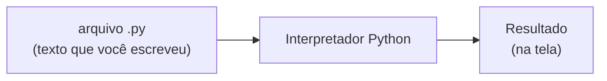

# Preparando o terreno: o que você precisa instalar antes de escrever Python

No capítulo anterior a gente entendeu por que Python é a linguagem escolhida pra esse módulo. Só que, antes de escrever a primeira linha de código, você precisa de duas coisas na sua máquina: o Python em si, e um lugar confortável pra escrever código. Esse capítulo é diferente dos outros. Não tem muito conceito, é mais um passo a passo, do jeito que eu queria que alguém tivesse feito pra mim. E ele parte do zero absoluto: se você nunca instalou nada parecido na vida, está no lugar certo.

## Interpretador: quem lê o seu código

Primeiro, uma coisa que pouca gente explica: o computador não entende Python. Ele só entende instrução de máquina, uma linguagem de baixíssimo nível que nenhum ser humano escreve no dia a dia. Então alguém precisa traduzir o que você escreveu pra algo que o computador consiga executar.

Existem dois jeitos principais de fazer essa tradução, e uma analogia ajuda.

- **Compilador** é como um tradutor de livro. Ele pega o texto inteiro, traduz tudo de uma vez e te entrega uma versão pronta. Só depois disso alguém "lê" (executa) o resultado.
- **Interpretador** é como um intérprete simultâneo numa palestra. Ele vai traduzindo e executando linha por linha, na hora, enquanto lê.

Python funciona do segundo jeito. Quando você "instala o Python" na sua máquina, o que você está instalando na prática é esse interpretador: o programa que lê o seu arquivo `.py` (a extensão dos arquivos Python) e executa cada instrução.



Isso é tudo que você precisa saber sobre o assunto por agora. Existe muita teoria por trás, mas ela não faz diferença nenhuma pra começar.

## IDE: onde você escreve o código

Um arquivo `.py` é só texto. Tecnicamente, dá pra escrever Python no Bloco de Notas do Windows. Mas isso é como fazer instalação elétrica sem alicate: dá, só que você sofre à toa.

É aí que entra a **IDE** (sigla em inglês pra "ambiente de desenvolvimento integrado"). É um programa feito pra escrever código, com uma série de ajudas: pinta cada parte do código de uma cor pra facilitar a leitura, avisa quando você digitou algo errado, completa nome de coisa pra você e tem um botão pra rodar o programa sem sair dali.

Algumas das mais comuns no mercado:

- **VS Code:** leve, gratuito, e serve pra praticamente qualquer linguagem. Ele vem "pelado" e você vai adicionando o que precisa através de extensões (pequenos complementos que você instala dentro dele).
- **PyCharm:** feito especificamente pra Python. Já vem mais completo de fábrica, mas também é mais pesado. Tem uma versão gratuita e uma paga.
- **Jupyter Notebook:** funciona diferente das outras duas. Em vez de um arquivo corrido, você escreve o código em blocos e vê o resultado de cada bloco logo embaixo dele. É muito usado em análise de dado e é ótimo pra experimentar.

Um detalhe, só pra você não se confundir se ler por aí: tecnicamente, o VS Code é classificado como um "editor de código" turbinado, e não como uma IDE completa. Na prática, depois das extensões, ele faz tudo que uma IDE faz, e todo mundo no dia a dia chama de IDE mesmo.

## Ferramenta certa pra cada serviço

Motosserra corta. Faca de pão também corta. Mas ninguém em sã consciência usa motosserra pra passar manteiga no pão, e ninguém derruba árvore com faca de pão. Cada ferramenta tem o serviço em que ela brilha.

Com IDE é a mesma coisa. Ferramenta é ferramenta, não time de futebol. Você vai encontrar gente defendendo a sua IDE preferida como se fosse religião, e não vale a pena entrar nessa. Aqui no curso a gente vai usar o **VS Code** por uma escolha prática: é gratuito, é leve, roda bem em computador mais simples e é muito usado no mercado. Não é porque as outras sejam erradas. Se um dia você achar que outra ferramenta serve melhor pro que você está fazendo, troca sem culpa.

E já adiantando: mais pra frente no curso vai aparecer o **Claude Code**, uma ferramenta bem mais moderna, que usa inteligência artificial pra te ajudar a trabalhar com código. Mas isso fica pra depois. Agora o foco é o básico, porque sem ele nenhuma ferramenta moderna vai fazer sentido.

## Instalando o Python (Windows)

Vou assumir que você usa Windows, porque é o caso da maioria das pessoas que estão começando. Se você usa Linux, provavelmente já sabe se virar (e muito provavelmente o Python já veio instalado). Se você usa Mac, o caminho começa pelo mesmo site oficial.

O passo a passo abaixo segue a lógica da documentação oficial do Python, que fica em [Using Python on Windows](https://docs.python.org/3/using/windows.html) (em inglês). Se alguma tela estiver diferente do que eu descrevo aqui, é lá que você confere o jeito atual.

Um aviso antes: nas versões mais recentes, o jeito recomendado de instalar Python no Windows mudou. Em vez de baixar um instalador do Python direto, você instala primeiro um programa chamado **Python Install Manager** (gerenciador de instalação do Python), e é ele que instala e mantém o Python atualizado pra você. Se você achar tutorial antigo mandando baixar um arquivo `.exe` e marcar uma caixinha chamada "Add Python to PATH", saiba que esse era o jeito antigo.

### Passo 1: instalar o Python Install Manager

Você tem dois caminhos, escolhe um.

- **Pela Microsoft Store (mais simples):** abre a Microsoft Store (ela já vem no Windows, procura no menu Iniciar), pesquisa por "Python Install Manager" e clica em instalar.
- **Pelo site oficial:** entra em [python.org/downloads](https://www.python.org/downloads/), baixa o instalador do Python Install Manager, dá dois cliques no arquivo baixado e clica em instalar.

### Passo 2: abrir o terminal

Pros próximos passos você vai precisar do **terminal**. Se você nunca abriu um, não se assusta: é só uma janela onde, em vez de clicar em botão, você digita um comando e aperta Enter. É uma forma de conversar com o computador por texto.

Pra abrir, clica no menu Iniciar, digita "Terminal" e abre o programa que aparecer.

### Passo 3: instalar o Python de fato

Com o terminal aberto, digita o comando abaixo e aperta Enter:

```
py install default
```

Isso pede pro Python Install Manager instalar a versão mais recente do Python. Espera terminar (pode levar alguns minutos, dependendo da internet).

### Passo 4: conferir se deu certo

Ainda no terminal, digita:

```
python --version
```

Se aparecer algo como `Python 3.14.7` (o número exato pode ser outro, tudo bem), o Python está instalado e funcionando.

Se aparecer uma mensagem de erro dizendo que o comando não foi encontrado, fecha o terminal, abre de novo e tenta outra vez. Se ainda assim não funcionar, a documentação oficial tem uma seção de solução de problemas (Troubleshooting) no mesmo link lá de cima.

## Instalando e configurando o VS Code

Agora a parte de onde você vai escrever código.

### Passo 1: instalar

Entra em [code.visualstudio.com](https://code.visualstudio.com/), baixa a versão pra Windows e instala. Pode ir aceitando as opções padrão do instalador, não precisa mudar nada.

### Passo 2: instalar a extensão do Python

Abre o VS Code. Na barra da esquerda tem um ícone de quatro quadradinhos, que é o de **extensões**. Clica nele, pesquisa por "Python" e instala a extensão chamada **Python** publicada pela **Microsoft** (confere o nome de quem publicou, porque existem várias parecidas). É ela que ensina o VS Code a entender Python e a conversar com o interpretador que você instalou antes.

### Passo 3: o primeiro teste

Chegou a hora de provar que o terreno está pronto.

1. Cria uma pasta nova em algum lugar fácil de achar (na Área de Trabalho, por exemplo), com um nome tipo `estudo-python`.
2. No VS Code, vai em **File** (Arquivo) e depois em **Open Folder** (Abrir Pasta), e escolhe essa pasta. Se ele perguntar se você confia nos autores dos arquivos, pode confirmar que sim, a pasta é sua.
3. Cria um arquivo novo dentro dela chamado `ola.py`.
4. Escreve essa linha dentro do arquivo e salva:

```python
print("Olá, mundo!")
```

5. No canto superior direito do VS Code tem um botão de "play" (um triângulo). Clica nele.

Vai abrir um terminal na parte de baixo do VS Code e, no meio de umas linhas de texto, deve aparecer `Olá, mundo!`. Se o VS Code perguntar qual interpretador usar, escolhe o Python que você instalou (ele costuma aparecer com o número da versão).

O `print` só manda o Python mostrar na tela o que estiver entre os parênteses. Não se preocupa em entender o resto agora, isso começa no próximo capítulo. O que importa é o que acabou de acontecer: você escreveu um arquivo `.py`, o interpretador leu esse arquivo e mostrou o resultado. É exatamente aquele diagrama lá do começo, funcionando na sua máquina.

## Fechando esse capítulo

Então é isso: o computador não entende Python direto, e o interpretador é quem lê e executa o seu código linha por linha. A IDE é o lugar onde você escreve esse código com ajuda, e existem várias, cada uma com seu ponto forte. A gente usa VS Code por praticidade, não por dogma. E agora você tem as duas coisas instaladas e testadas na sua máquina.

No próximo capítulo a gente começa o primeiro passo prático do bloco de fundamentos: **variável e tipo de dado**, ou seja, como um programa guarda informação e que tipos de informação existem.
