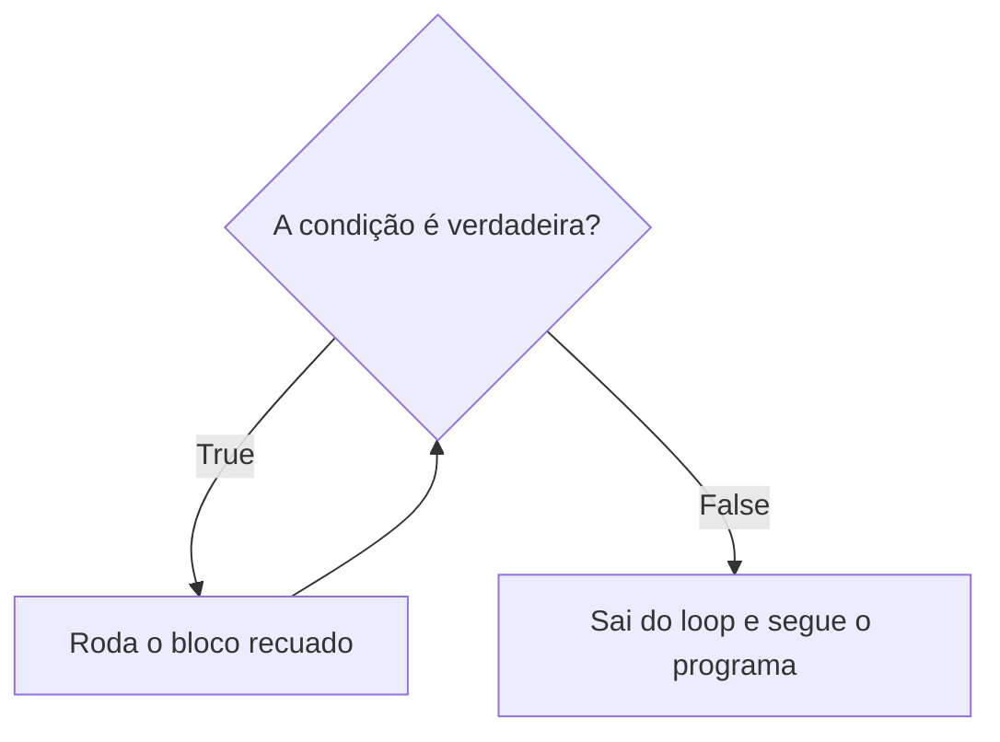

# Repetição (loop): deixando o trabalho chato pro programa

## Pete e Repete

> Era uma vez dois cachorros, o Pete e o Repete. O Pete morreu. Quem ficou?
>
> Repete.
>
> Era uma vez dois cachorros, o Pete e o Repete. O Pete morreu. Quem ficou?
>
> Repete.
>
> Era uma vez dois cachorros...

Aposto que, se você é da minha geração, já caiu nessa quando criança (e provavelmente contou pra alguém depois, só pelo prazer de ver a pessoa cair também). E o seu amigo que contou isso pra você, sem saber, já estava descrevendo um **loop de repetição**: a mesma sequência de passos, rodando de novo e de novo, sempre voltando pro começo.

Piada à parte, isso tem muita utilidade fora do recreio. Lembra do exemplo das três bombas lá no capítulo de string? A gente escreveu isso aqui:

```python
print(bomba_1.upper(), vibracao_1)
print(bomba_2.upper(), vibracao_2)
print(bomba_3.upper(), vibracao_3)
```

Três linhas quase iguais, mudando só o número. Com três bombas, tudo bem. Agora imagina uma planta de verdade, com quinhentas bombas. Você vai escrever quinhentos `print()`? E quando chegar na linha 347, cansado, com sono, e digitar `vibracao_374` em vez de `vibracao_347`? O programa roda feliz, mostra o valor errado, e ninguém percebe.

Aqui mora uma ideia que muda o jeito de enxergar programação: **repetir tarefa chata é justamente o que o computador faz de melhor**. Ele não cansa, não fica com sono, não se distrai com o celular e não erra na linha 347. Escrever a mesma instrução na mão, uma por uma, é desperdiçar a maior força que um programa tem.

Pra aproveitar essa força existe o **loop** (ou **laço de repetição**, em português): um bloco de código que o Python roda várias vezes seguidas. Você escreve a instrução uma vez só, e diz quantas vezes (ou até quando) ela deve se repetir. Em Python existem dois jeitos de fazer isso, o `for` e o `while`, e esse capítulo é sobre os dois.

## O que existia antes

Sem loop, o jeito é o que a gente fez lá em cima: copiar a linha, colar, trocar o número, copiar de novo, colar de novo. É o mesmo problema do "na mão" que já apareceu no capítulo de string e no de condicional. Funciona com três casos. Não funciona com quinhentos, e funciona menos ainda quando amanhã a planta instala a bomba 501 e você precisa lembrar de voltar no código pra acrescentar mais uma linha.

## for: a alcinha do Excel

Se você já mexeu com Excel, provavelmente já fez isso: digita `1` numa célula, `2` na de baixo, seleciona as duas, pega aquela alcinha no cantinho da seleção e arrasta pra baixo. O Excel preenche `3, 4, 5, 6...` sozinho, até onde você soltar o mouse.

Agora imagina fazer isso sem a alcinha: clicar na célula, digitar `3`, Enter, digitar `4`, Enter, digitar `5`... até o 500. Ninguém faz isso (e se você faz, esse capítulo é um presente). A alcinha é você dizendo pro Excel "segue esse padrão aí que eu não vou digitar um por um". O `for` é a alcinha do Python.

### Como se escreve um for

```python
for numero in range(1, 6):
    print(numero)
```

Rodando isso, a tela mostra:

```
1
2
3
4
5
```

Lendo em português: "para cada número de 1 a 5, mostra esse número na tela". Peça por peça:

- `for`: a palavra que começa o loop.
- `numero`: uma variável que o próprio `for` cria. A cada volta do loop, ela recebe o próximo valor da sequência. Na primeira volta vale `1`, na segunda vale `2`, e assim por diante. O nome é você quem escolhe, igual qualquer variável.
- `in range(1, 6)`: de onde vêm os valores (o `range()` a gente vê já já).
- Os **dois pontos** no final da linha, igual no `if`.
- Embaixo, o bloco **recuado**, que é o que vai se repetir.

Aquela regra do capítulo de condicional continua valendo: **o recuo não é enfeite**. Tudo que estiver recuado debaixo do `for` roda a cada volta. O que estiver encostado na margem roda uma vez só, depois que o loop terminar:

```python
for numero in range(1, 4):
    print(f'Verificando bomba {numero}...')
print('Ronda terminada.')
```

```
Verificando bomba 1...
Verificando bomba 2...
Verificando bomba 3...
Ronda terminada.
```

Cada volta do loop tem um nome técnico, **iteração**, e você vai ver essa palavra muito por aí. É só um jeito chique de dizer "uma volta".

### range(): start, stop e step

O `range()` é quem gera a sequência de números que o `for` percorre. Ele aceita até três informações, separadas por vírgula: onde começa (**start**), onde para (**stop**) e de quanto em quanto anda (**step**).

**Só o stop.** Se você passar um número só, o `range()` começa do `0`:

```python
for numero in range(5):
    print(numero)
```

```
0
1
2
3
4
```

Duas coisas pra reparar. Começou do `0`, igual o índice da string no capítulo 4. E parou no `4`, não no `5`. Isso porque **o stop não entra no resultado**. É exatamente a mesma pegadinha do fatiamento, lembra? `tag[6:11]` pegava do 6 até o 10. Aqui é igual: `range(5)` vai do 0 até o 4. São cinco números no total, que é o que importa quando você só quer repetir algo cinco vezes.

**Start e stop.** Se você quer começar de outro lugar, passa os dois:

```python
for numero in range(1, 6):
    print(numero)
```

Esse é o do começo do capítulo: vai do `1` até o `5`. De novo, o `6` não entra.

**Start, stop e step.** O terceiro número diz o tamanho do passo:

```python
for numero in range(0, 20, 5):
    print(numero)
```

```
0
5
10
15
```

De 5 em 5, e o `20` não entra. É igual digitar `0` e `5` no Excel antes de arrastar a alcinha: ele entende que o padrão é de 5 em 5.

E o passo pode até ser negativo, pra contar de trás pra frente. Contagem regressiva pro fim do expediente:

```python
for minuto in range(3, 0, -1):
    print(f'Faltam {minuto} minuto(s) pra ir embora...')
print('Fui!')
```

```
Faltam 3 minuto(s) pra ir embora...
Faltam 2 minuto(s) pra ir embora...
Faltam 1 minuto(s) pra ir embora...
Fui!
```

## for direto numa coleção

O `range()` é ótimo quando você precisa de uma sequência de números. Só que, no dia a dia de dado, na maioria das vezes você não quer contar de 1 a 500. Você já tem as coisas (os textos, as bombas, as leituras) e quer passar por cada uma delas. E o `for` faz isso direto, sem precisar de `range()` nenhum.

### Percorrendo uma string

Uma string é uma sequência de caracteres, então o `for` consegue passar por ela letra por letra:

```python
for letra in 'BOMBA':
    print(letra)
```

```
B
O
M
B
A
```

Parece bobo, mas junta isso com o `if` do capítulo anterior e já dá pra fazer algo útil. Por exemplo, contar quantos traços tem numa tag:

```python
tag = 'AREA2-BOMBA-01'
tracos = 0

for caractere in tag:
    if caractere == '-':
        tracos = tracos + 1

print(f'A tag tem {tracos} traços.')
```

```
A tag tem 2 traços.
```

A variável `tracos` começa em `0`, e a cada volta o `if` confere se aquele caractere é um traço. Se for, soma 1. Repara no recuo: o `if` está dentro do `for` (roda a cada letra), o `tracos = tracos + 1` está dentro do `if` (só roda quando é traço), e o `print()` final está fora de tudo (roda uma vez só, no fim).

### Percorrendo uma lista

No capítulo de string, o `.split()` devolveu um negócio entre colchetes, tipo `['AREA2', 'BOMBA', '01']`. Isso é uma **lista**, que ainda vai ganhar capítulo próprio mais pra frente. Por agora, basta saber que ela guarda vários valores juntos, um atrás do outro, e que você mesmo pode criar uma escrevendo os valores entre colchetes, separados por vírgula.

E o `for` passa por ela do mesmo jeito que passa pela string, só que item por item:

```python
bombas = ['Bomba 01', 'Bomba 02', 'Bomba 03']

for bomba in bombas:
    print(f'Verificando {bomba}...')
```

```
Verificando Bomba 01...
Verificando Bomba 02...
Verificando Bomba 03...
```

(Uma convenção comum, e que ajuda muito a ler: a lista no plural, `bombas`, e a variável do loop no singular, `bomba`. "Para cada bomba nas bombas".)

Agora sim dá pra resolver o problema da abertura. Lembra dos nomes sujos do capítulo de string? Em vez de limpar um por um, joga todos numa lista e deixa o loop trabalhar:

```python
bombas = [' Bomba 1 ', 'bomba 2', 'BOMBA 3']

for bomba in bombas:
    print(bomba.strip().upper())
```

```
BOMBA 1
BOMBA 2
BOMBA 3
```

E aqui está o pulo do gato: se amanhã a lista tiver três mil bombas, o código continua exatamente com essas quatro linhas. Quem cresce é o dado, não o código.

Funciona até com o resultado do `.split()` direto:

```python
for parte in 'AREA2-BOMBA-01'.split('-'):
    print(parte)
```

```
AREA2
BOMBA
01
```

## while: enquanto a condição for verdadeira

Antes do código, duas situações que (tenho certeza) você já viveu.

**A primeira:** aula chata, professor falando há quarenta minutos sobre um assunto que ninguém entendeu, e você ali, mexendo no celular por baixo da mesa. Você não decidiu "vou mexer no celular por 23 minutos". Você só vai mexendo, mexendo, mexendo... **enquanto** tiver bateria. Quando a bateria acaba, aí sim, não tem jeito, você levanta a cabeça e finge que estava prestando atenção desde o começo.

**A segunda:** madrugada, você acorda com fome, levanta, vai até a geladeira, abre, olha. Nada. Fecha, volta pra cama. Dez minutos depois, levanta de novo, vai até a geladeira, abre, olha. Nada, óbvio, ninguém foi no mercado nesse meio tempo. E mesmo assim, meia hora depois, lá vai você de novo. Você fica repetindo a mesma checada **enquanto** não tiver comida, sem aprender absolutamente nada entre uma ida e outra.

Esse é o `while` ("enquanto", em inglês). Ele não sabe quantas vezes vai repetir. Ele só sabe a condição: **enquanto** ela for verdadeira, continua repetindo. E, igual você na frente da geladeira, ele confere a condição de novo a cada volta, sem guardar nenhuma lição da volta anterior.

### Como se escreve um while

```python
bateria = 100

while bateria > 0:
    print(f'Bateria em {bateria}%, mais um vídeo...')
    bateria = bateria - 25

print('Acabou a bateria. Agora sim, prestando atenção na aula.')
```

```
Bateria em 100%, mais um vídeo...
Bateria em 75%, mais um vídeo...
Bateria em 50%, mais um vídeo...
Bateria em 25%, mais um vídeo...
Acabou a bateria. Agora sim, prestando atenção na aula.
```

A estrutura é a mesma cara do `if`: a palavra `while`, uma condição (que, como você viu no capítulo anterior, sempre vira `True` ou `False`), os dois pontos e o bloco recuado. A diferença é que o `if` roda o bloco **uma vez** se a condição for verdadeira, e o `while` roda o bloco **de novo e de novo**, enquanto ela continuar verdadeira.

O ciclo é esse aqui:



Repara na linha `bateria = bateria - 25`. Ela é a peça mais importante do código inteiro: é ela que vai mudando o valor, até o dia em que `bateria > 0` vira `False` e o loop termina. Sem ela, a bateria ficaria em 100 pra sempre (e isso tem consequência, que aparece lá nos trade-offs).

Um exemplo onde fica bem claro que não dá pra saber de antemão quantas vezes vai repetir:

```python
resposta = ''

while resposta != 'sim':
    resposta = input('Já terminou a manutenção? ')

print('Beleza, pode liberar o equipamento.')
```

O programa vai perguntar uma vez, duas, dez, quantas forem necessárias, até alguém digitar `sim`. Quantas vezes? Depende de quem está do outro lado. O `while` não precisa saber.

### for ou while?

A diferença central entre os dois é essa:

- **for:** eu sei de antemão quantas vezes vai repetir. Pode ser porque eu passei um `range()` com o número de voltas, ou porque tenho uma coleção pronta (uma string, uma lista) e quero passar por cada item dela.
- **while:** eu não sei quantas vezes vai repetir. Só sei a condição de parada.

No dia a dia de dado, o `for` aparece muito mais, porque quase sempre você já tem o dado na mão e quer passar por ele inteiro. O `while` fica pros casos em que você está esperando alguma coisa acontecer.

## break e continue: pulando e parando

Às vezes, no meio do loop, você precisa mudar o plano. Pra isso existem duas palavrinhas.

**continue: pula essa volta e vai pra próxima.** Pensa num processamento de registros onde, no meio, tem linha vazia (acontece o tempo todo). Você não quer parar tudo por causa disso, só quer ignorar aquela linha e seguir:

```python
registros = ['Bomba 01', '', 'Bomba 02', '   ', 'Bomba 03']

for registro in registros:
    if registro.strip() == '':
        continue
    print(f'Processando {registro}')
```

```
Processando Bomba 01
Processando Bomba 02
Processando Bomba 03
```

Quando o registro é vazio (ou só tem espaço, por isso o `.strip()` antes de comparar), o `continue` faz o Python abandonar aquela volta na hora, sem rodar o resto do bloco, e ir direto pro próximo item.

**break: para o loop inteiro, agora.** Agora imagina que no meio dos registros aparece um sinal de que o arquivo está corrompido. Aí não adianta pular, porque tudo que vem depois pode estar errado também:

```python
registros = ['Bomba 01', 'Bomba 02', 'ARQUIVO CORROMPIDO', 'Bomba 03']

for registro in registros:
    if registro == 'ARQUIVO CORROMPIDO':
        print('Erro grave, parando o processamento.')
        break
    print(f'Processando {registro}')
```

```
Processando Bomba 01
Processando Bomba 02
Erro grave, parando o processamento.
```

A `Bomba 03` nem chega a ser vista. O `break` faz o Python sair do loop na hora e seguir pro que vier depois dele. Parece exagero parar tudo, mas em dado é muito melhor parar e avisar do que entregar um relatório pela metade que todo mundo acha que está completo.

Resumindo: `continue` é "esse aqui não, próximo". `break` é "para tudo".

## Trade-offs: onde isso começa a apertar

**O loop infinito.** Lembra da geladeira? Em código, ela fica assim:

```python
tem_comida = False

while not tem_comida:
    print('Abro a geladeira... nada. Volto pra cama.')
```

Nada dentro do loop muda o valor de `tem_comida`, então a condição é verdadeira pra sempre, e o programa fica mostrando essa mensagem até o fim dos tempos (ou até o seu computador reclamar). É o erro mais clássico do `while`: esquecer a linha que faz a condição mudar, tipo o `bateria = bateria - 25` lá de cima. Se isso acontecer com você (e vai acontecer), clica no terminal do VS Code e aperta **Ctrl+C**. O Python interrompe o programa e mostra um `KeyboardInterrupt`, que é só ele dizendo "ok, você me mandou parar". O `for` quase nunca sofre disso, porque a coleção ou o `range()` sempre têm fim.

**O stop do range() que não entra.** Você quer verificar as bombas de 1 a 10, escreve `range(1, 10)`, e a bomba 10 fica de fora sem ninguém perceber. Não dá erro nenhum, o programa só faz uma volta a menos. Na dúvida, roda o loop com um `print()` dentro e confere o primeiro e o último valor antes de confiar.

**Loop em Python passa item por item.** Pra algumas centenas ou milhares de itens, isso é instantâneo. Quando o dado chega em milhões de linhas, um loop escrito na mão começa a pesar. Pra esse volume existem ferramentas próprias, que aparecem mais pra frente no módulo. O loop continua sendo a base pra entender o que essas ferramentas fazem por baixo dos panos.

## Exemplo prático: juntando tudo

Pra fechar, de volta pra vibração das bombas. Chegou uma lista de leituras do sensor, e ela veio do jeito que dado real costuma vir: com leitura vazia no meio, e com um erro de sensor em algum ponto. O limite de vibração considerado normal é 7.0. A ideia é passar por cada leitura, pular as vazias, parar tudo se o sensor der erro, e avisar quando alguma leitura passar do limite:

```python
leituras = [4.2, 7.8, '', 3.1, 9.4, 'ERRO', 5.0]
limite = 7.0
processadas = 0

for leitura in leituras:
    if leitura == '':
        print('Leitura vazia, pulando.')
        continue
    if leitura == 'ERRO':
        print('Sensor com erro, parando o processamento.')
        break
    processadas = processadas + 1
    if leitura > limite:
        print(f'ALERTA: vibração de {leitura}, acima do limite.')
    else:
        print(f'Vibração de {leitura}, tudo normal.')

print(f'Leituras processadas: {processadas}')
```

Rodando isso, a tela mostra:

```
Vibração de 4.2, tudo normal.
ALERTA: vibração de 7.8, acima do limite.
Leitura vazia, pulando.
Vibração de 3.1, tudo normal.
ALERTA: vibração de 9.4, acima do limite.
Sensor com erro, parando o processamento.
Leituras processadas: 4
```

Acompanhando volta por volta: as duas primeiras leituras passam pelo `if` do limite, uma normal e uma em alerta. A terceira é vazia, então o `continue` pula ela antes de chegar na conta. A quarta e a quinta seguem o caminho normal. Na sexta aparece o `'ERRO'`, e o `break` encerra o loop ali mesmo. O `5.0` do final nunca é processado, e o contador mostra 4, porque a leitura vazia e o erro não contam.

Repara que tem de tudo aqui dentro: `for` passando por uma lista, `if` e `else` do capítulo anterior decidindo o que fazer com cada leitura, `continue` pulando a sujeira, `break` parando no problema sério, e um contador que vai somando a cada volta. Sete leituras ou sete mil, o código é o mesmo.

## Fechando esse capítulo

Loop é o jeito de fazer o programa repetir uma tarefa sem você escrever a mesma instrução várias vezes, e repetir é exatamente onde o computador é imbatível. O `for` repete quando você já sabe quantas vezes vai ser: com `range()` (start, stop e step, lembrando que o stop não entra) ou passando direto por cada item de uma string ou de uma lista, que é o uso mais comum no dia a dia de dado. O `while` repete enquanto uma condição for verdadeira, e é pra quando você não sabe quantas voltas vão ser, só quando parar. Dentro de qualquer um dos dois, o `continue` pula uma volta e o `break` encerra o loop. E todo `while` precisa de alguma coisa lá dentro que faça a condição mudar, senão você fica na frente da geladeira pra sempre.

Com isso, as duas metades da estrutura de controle estão completas: o programa já sabe decidir e sabe repetir. No próximo capítulo a gente vê **função**, ou seja, como empacotar um pedaço de lógica pra reaproveitar sem precisar escrever tudo de novo.
